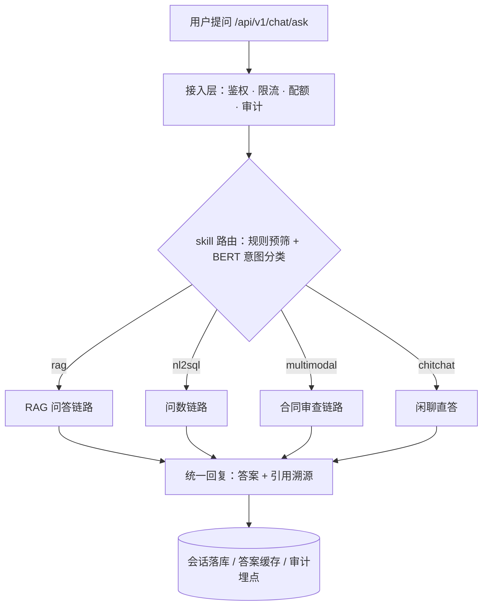
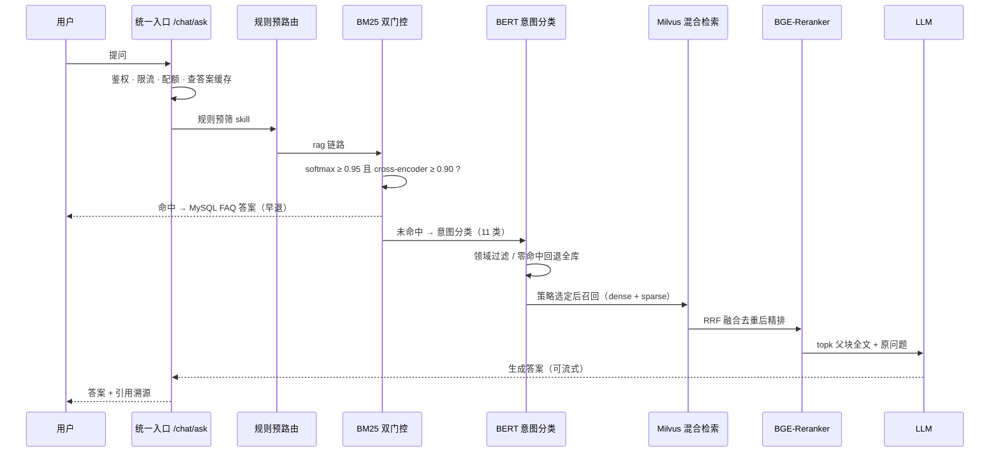

# FinRag 金融智能问答系统 —— 完整流程说明（技术版）

> 本文档按「教育平台 RAG 流程说明」的骨架撰写：**1 初始化 BM25 → 2 离线知识库搭建 → 3 主体流程**，
> 每节都用「【同】/【不同】」标注与教育平台版本的差异，并在文末附中英对照总表。
>
> 文档范围：RAG 问答主链路（本文主体）。问数（NL2SQL）与合规审查（DocAudit）作为本项目在骨架之外
> 增设的两条链路，在第 4 节简述。

---

## 0. 阅读须知：两套系统的对应关系

| 环节 | 教育平台（原流程） | 本项目（FinRag） | 关系 |
|---|---|---|---|
| 高频问答早退判定 | softmax 分数 > 单阈值 | softmax ≥ 0.95 **且** cross-encoder 绝对相关分 ≥ 0.90（双门控） | 加固 |
| 高频问答语料缓存 | Redis 缓存问题与分词结果 | 进程内懒加载 + 定时刷新，Redis 另作答案缓存/会话/限流 | 改变 |
| 离线建库触发方式 | 脚本递归读取本地目录 | API 异步上传管线（排队、限流、可取消） | 升级 |
| 分块方式 | 父子分块 | 父子分块 + 全局唯一 chunk id | 一致 |
| 向量 | 单一向量 | BGE-M3 稠密 + 稀疏双向量 | 升级 |
| 意图识别 | 二分类：通用 / 专业 | 11 类金融子领域分类 + 三类兜底 + 固定搭配覆盖 | 升级 |
| 检索策略选择 | 每条 query 均由 LLM 判断 | 规则预筛优先，LLM 兜底默认关闭 | 改变 |
| 混合检索 + 重排 | 混合检索 → 重排序 → topk 父文档 | dense+sparse → RRF 融合去重 → 重排（用子块文本）→ topk 父块 | 加固 |
| 主分流依据 | 缓存命中阈值 | **统一编排的 skill 路由 + 身份权限域过滤** | 结构性差异 |
| 评估闭环 | （原流程未提及） | RAGAS 四维指标 + 实验对比 + 回归验证 | 新增 |
| 额外能力 | 无 | 问数（NL2SQL）、合同合规审查、多模态解析 | 新增 |

> **一句话概括结构性差异**：教育平台的主分流是「缓存命中与否」，本项目的主分流是
> 「意图 + 身份权限」（skill 路由与知识库属主模型）——这一点是理解本项目流程的前提。

### 系统分层（Mermaid）

---

## 1. 初始化 BM25 模型

1. 服务启动时由后台守护线程**懒加载** BM25 索引（不阻塞主进程启动，加载失败则在首次请求时重试）。
2. 从 MySQL 高频问答对表 `finance_faq`（金融 FAQ 表）读取**全部**问答对及其领域标签。
3. 对每条问题做 jieba 分词，构建语料与词频。
4. 用 `rank_bm25` 建立 BM25 索引，索引支持按领域（`category`，领域标签）过滤。
5. 索引带**定时刷新**：FAQ 数据变更后，最多延迟一个刷新周期即自动感知并重建。

**【同】** 分词、构建语料、建立 BM25 索引的主体思路一致。

**【不同】** 两点：
- 教育平台把「问题 + 分词结果」缓存在 Redis，避免重复分词；本项目不缓存到 Redis，改为**进程内懒加载 + 定时刷新**，理由是 FAQ 语料规模不大、进程内索引检索无网络开销，且刷新机制能自动感知 FAQ 变更。Redis 在本项目的职责转移为：答案缓存（`finrag:qa:` 前缀）、会话存储、分布式限流、上传队列状态。
- 索引构建是**领域可过滤**的，为第 3 节的「检索域动态过滤」预留能力。

---

## 2. 离线知识库搭建

### 2.1 读取文档

**本项目不是"递归读取本地目录"的离线脚本，而是 API 异步上传管线：**

1. 调用 `POST /document/upload`（文档上传接口）上传文件，**立即返回** `doc_id`（文档编号），不阻塞请求。
2. 后台守护线程串行处理：用 `Semaphore(1)`（串行信号量）排队，避免多文件并发解析与编码导致 CPU 打满。
3. 上传前置校验：扩展名白名单（仅 PDF/DOCX/TXT/MD 等支持格式）、文件大小上限 `MAX_UPLOAD_SIZE`（50MB，超限返回 413，且为流式边读边判，不把大文件读进内存）。
4. 按扩展名选择对应解析器（解析器字典），PDF 走 PyMuPDF 分层提取。
5. 读取文档内容后，把元数据注入 `metadata`（块元数据）：`kb_id`（知识库编号）、`doc_id`（文档编号）、`source_file`（来源文件名）、`domain`（领域）、`category`（检索过滤用的领域标签）。
6. 返回 `List[Document]`。
7. 支持**取消**：解析过程中调 `POST /document/cancel/{doc_id}`，通过 `threading.Event`（线程事件）在批次间中断并回滚已写入向量。
8. 服务重启时对账：仍处于 `parsing`（解析中）状态的文档会被标记为 `failed`，避免僵尸任务。

**【同】** 按扩展名选解析器、读取内容、注入 metadata、返回文档列表的结构完全一致。

**【不同】** ①触发方式从"离线脚本扫目录"升级为"在线 API + 后台任务队列"；②增加了串行排队、限流、可取消、断点对账等生产化能力；③metadata 里多了 `kb_id`/`doc_id`/`domain` 等用于权限与检索过滤的字段。

### 2.2 文档分块（父子分块）

1. 分别定义父块分割器与子块分割器（父块粒度大、子块粒度小）。
2. 先分父块，再在每个父块内部分子块。
3. 将父块全文写入每个子块的 `metadata`，建立「子块 → 父块」的关联。
4. 返回所有子块列表。

**本项目的字段语义（容易踩坑，务必区分）**：

- `question`（问题字段）在各子块里实际存的是 **chunk id**（块编号，形如 `doc_{doc_id}_parent_{j}_child_{k}`）——**全局唯一**，不含语义；
- `text`（文本字段）存**子块原文**，也是向量化时真正使用的文本；
- `answer`（答案字段）存**父块全文**，命中后作为上下文返回给模型。

**【同】** 父子分块、父块内容挂到子块 metadata 的关联方式一致。

**【不同】** ①chunk id 改为「文档编号 + 父块序 + 子块序」的全局唯一编号（早期用文件序号生成，同库多文件会编号碰撞，导致检索去重丢块与内容串扰）；②字段职责被严格区分，任何按 `question` 做语义处理（重排、去重展示）的代码都必须先判断它是否为 chunk id。

### 2.3 在 Milvus 中创建向量集合

1. 启动时检查集合（collection）是否存在，不存在则按 schema 创建。
2. **Schema 保护**：若已存在集合的 schema 与代码定义不匹配，默认**直接抛 `RuntimeError` 并终止启动**，绝不静默删除重建（避免误删线上向量数据）；开发环境可用 `MILVUS_AUTO_RECREATE=1` 作为逃生门，人工重建走专用脚本。

**【同】** 建集合的目的与位置一致。

**【不同】** 教育平台的脚本式建库通常"存在即跳过"；本项目把 schema 一致性做成了**启动即校验的保护机制**，把"静默数据损坏"这一类事故挡在启动阶段。

### 2.4 分块数据向量化

1. 用 BGE-M3 模型对子块文本编码，一次性同时产出**稠密向量**与**稀疏权重（lexical weights）**，分别服务于语义召回与关键词召回。
2. 按 **64 块/批** 分批编码，避免单次进显存/内存过大。
3. CPU 线程保护：把 PyTorch 线程数限制为 CPU 核数的一半（默认 8/16），可用环境变量 `FINRAG_TORCH_THREADS` 覆盖；多文档排队处理时不会线程叠加。

**【同】** 用 BGE-M3 把分块文本转成向量。

**【不同】** ①产出的是**双向量**（稠密 + 稀疏），用于混合检索，而非单一稠密向量；②分批编码、CPU 线程保护是新增的工程约束。

### 2.5 向量写入向量数据库

1. 编码结果按批次写入 Milvus 集合，同时写入 `kb_id`/`doc_id`/`source_file` 等 metadata。
2. MySQL 侧的文档状态流转：`pending`（待处理）→ `parsing`（解析中）→ `indexed`（已入库）/ `failed`（失败）/ `cancelled`（已取消）。
3. 写入完成后同步知识库的 `doc_count`（文档数）字段，并**清理问答缓存**（`finrag:qa:` 前缀）——否则用户提问会拿到文档变更前的旧答案（最长 24 小时）。
4. 删除文档时按 `metadata["doc_id"]` 精确删除；由于 Milvus 的插入/删除存在秒级可见性延迟，采用「删除后复核、未清空再删」的多轮重试策略。

**【同】** 向量与元数据落库、写状态。

**【不同】** ①MySQL 与 Milvus 双写并维护状态机；②缓存失效被纳入写入流程（文档变更即清缓存）；③删除做了可见性延迟兜底——这三点都是生产化才暴露出来的问题。

---

## 3. 主体流程（MySQL 高频问答 + RAG 在线检索）

按原骨架编号逐条对应：

**(1) 统一入口与缓存查询**
用户 query 进入 `/chat/ask`（统一编排入口），依次完成鉴权、分布式限流、LLM 配额校验、审计埋点与会话管理；随后按缓存键 `ask:{skill}:{role}:{question}` 查询 Redis 答案缓存，命中则直接返回。
**【不同】** ①教育平台第一步是"查 Redis 问题缓存"，本项目第一步是"过接入治理层"——**鉴权与限流前置**；②缓存键带 `skill`（技能类型）与 `role`（角色）两个维度：前者防止问数的旧答案污染文档问答，后者防止管理员可见内容泄露给普通用户。

**(2) 规则预路由决定技能（skill）**
由 `_decide_skill()` 做零开销规则预筛，判定本次请求属于哪条链路，优先级顺序为 **multimodal（多模态）> rag（知识问答）> nl2sql（问数）> chitchat（闲聊）**。
**【同】** 相当于教育平台的"是否通用问题"判断。
**【不同】** ①判定结果从"二分类"变为"四链路路由"；②顺序不可调换——`rag` 必须优先于 `nl2sql`，因为问数的关键词表里曾包含"最高/平均/增长"等泛词，会把"存款保险最高赔付多少"这类文档问答误判成问数。

**(3) query 分词并交给 BM25 计算相似度**
对 query 做 jieba 分词，将分词结果送入 BM25 索引做相似度计算（按需限定领域）。
**(4) softmax 归一化**
将分数映射到 (0, 1) 区间。
**(5) argmax 取最高分**
取最高得分对应的 FAQ 条目。
**(6) 阈值比较（本项目为双门控）**
**【不同，核心差异】** 教育平台只用 softmax 与单阈值比较；本项目要求 **两个条件同时满足**才早退：
- 条件一：softmax ≥ `BM25_EARLY_RETURN_THRESHOLD`（0.95）；
- 条件二：该候选经 cross-encoder 打出的**绝对相关分** ≥ `BM25_EARLY_RETURN_RERANK_MIN`（0.90）。

原因是实测发现：softmax 衡量的是"比其它 FAQ 领先多少"的**相对**分数，并不代表真实相关。曾经出现「股票发行注册制改革」误命中 FAQ「债券注册制改革全面落地」，softmax 高达 0.985，而 cross-encoder 相关分只有 0.047。**单纯调高阈值治不了本**（0.985 已贴近 1.0），必须引入绝对相关性判断。校准数据：误命中负样本约 0.047，精确命中/改写正样本约 0.9988~1.0，区间极宽，判定稳定。

**(7) 命中则从 MySQL 取答案并回写缓存**
从 `finance_faq` 取对应答案返回用户，同时写入 Redis 缓存。
**【同】** 与教育平台一致。
**【不同】** 需要注意一个诊断细节：早退路径下响应里 `sources` 只有 1 条、其 `question` 是完整 FAQ 问句（而非 chunk id）、`confidence` 恰等于 BM25 softmax；且此时 `domain`（领域）取自 **FAQ 自身的 category**，**不经过意图分类器**——因此不能用响应里的 `domain` 判断意图分类是否生效。另外，早退会**完全跳过** Milvus 文档检索，若知识库里上传了新文档而问题恰好命中 FAQ，会走不到文档——这正是双门控要严格收紧的原因。

**(8) 未命中则进入 RAG：意图识别**
将 query 交给微调的 `bert-base-chinese` 意图分类器，做 **11 类**金融子领域分类（banking、corporate_finance、financial_accounting、financial_markets、fintech、insurance、investment_banking、personal_finance、risk_management、stock_market、general）。
**【不同，核心差异】** 教育平台是二分类且只用于判断"是否通用问题、要不要直接调大模型"；本项目是**多分类 + 检索域过滤**，分类结果直接决定检索时过滤哪个领域，并配三类兜底：
- 置信度 < 0.5 时回退关键词匹配；
- 「存款保险」等跨域歧义词用固定搭配覆盖规则强制路由（优先级高于 BERT），否则会被表层词带偏到 insurance 域，导致 banking 域的《存款保险条例》召回不到；
- 领域过滤零命中时**自动回退全库检索**，保障兜底覆盖率。

**(9) 专业咨询：选择检索策略**
**【不同】** 教育平台把 query 交给大模型来"得到合适的检索策略"（每条 query 都要一次模型调用）；本项目改为**规则预筛优先**：先用零开销规则判定问题形态（对比类 / 开放类 / 多轮依赖类），规则无法判定时才调用大模型兜底，且该兜底**默认关闭**（配置项 `strategy_llm_fallback`）。这样绝大多数请求不产生额外延迟。

**(10) 三种检索策略（与原流程一一对应）**
- **直接检索**：不做改写，直接进入检索；
- **假设问题检索 / 简化问题检索**：取对应改写提示词，让大模型对 query 改写，再对改写后的 query 检索；
- **子问题分解检索**：让大模型把 query 拆解为不超过 **3 个子查询**的列表，逐个检索后合并。

**【同】** 三种策略的划分与教育平台一致（直接 / 改写 / 分解）。
**【不同】** ①改写**只作用于召回阶段，精排始终以原始提问为准**（这一点与原流程一致，本项目把它固化为设计约束）；②任一策略失败自动降级为直接检索；③规则预筛命中时无额外延迟开销。

**(11) 混合检索 + 重排序，取 topk 父文档作为上下文**
在 Milvus 中做**稠密 + 稀疏双路召回**（按 `category == domain` 过滤），经 **RRF（Reciprocal Rank Fusion，倒数排名融合）** 去重合并后，送入 BGE-Reranker 精排，取 topk，回查**父块全文**作为上下文。
**【同】** "混合检索 → 重排序 → topk 父文档作上下文"的整体结构一致。
**【不同】** ①明确为 dense + sparse 双路召回 + RRF 融合；②**重排必须用子块 `text` 打分，不能用父块全文 `answer`**——用父块全文会让 BGE-Reranker 分数饱和到 0.99 左右，导致无关长文本霸榜（这是实测踩过的坑，已封装为统一入口 `rerank_text()`）；③命中后回查父块全文作为上下文（与原流程的"topk 父文档"一致）。

**(12) 上下文与 query 拼装为完整提示词**
检索到的上下文（父块全文）与用户原问题拼装成最终提示词。
**【同】** 一致。

**(13) 大模型生成最终回答并返回**
调用大模型生成答案，返回给用户。
**【同】** 一致。
**【不同】** ①支持 **SSE 流式输出**（`/chat/ask_stream`），且流式事件的 JSON 必须用 `json.dumps` 转义——早期用 f-string 直接插值 LLM 原文（含引号/换行）会让前端解析崩溃；②回答附带**引用溯源**；③回答落会话历史、写答案缓存；④LLM 配降级链：主模型失败自动重试备用模型一次。

### 主体流程时序（Mermaid）

---

## 4. 骨架之外：本项目增设的三条链路

### 4.1 问数链路（NL2SQL，融合 ChatBI）

元数据存储（MetaStore）→ Schema 召回 → 大模型生成 SQL → **SQLGuard**（SQL 安全校验：只读、表白名单、禁多语句）→ **口径校验**（确定性正则回检派生指标，如客单价禁用 `AVG`、退货率必须关联退款表）→ 只读连接池执行（独立只读账号 + 会话级只读 + 执行超时 + EXPLAIN 预检）→ 失败回喂重写（自修复 ≤ 3 轮）。

### 4.2 合规审查链路（DocAudit，融合多模态）

上传 PDF/图片 → 页级多模态解析路由（数字页 PyMuPDF 直提 / 扫描页 RapidOCR / 低置信页 qwen-vl 视觉兜底）→ 条款抽取 → 规则库比对风险分级（violation/compliant × high/medium/low）→ 报告生成 + 人工复核（HITL）。该链路是**长任务独立端点**（`/review/upload` + 事件轮询），不放在主问答图里。

### 4.3 评估闭环

RAGAS 四维指标（Faithfulness、Context Recall、FactualCorrectness、Answer Relevancy）+ 三套自研评估脚本（路由 / 问数 / 审查）+ 实验对比接口，形成「调整 → 评估 → 对比 → 回滚」的迭代闭环。

---

## 5. 从开发形态到企业级形态的升级口径

以下为**架构升级口径**（协议与契约不变，只换连接方式），不代表当前环境已部署：

| 开发/单机形态 | 企业级形态 |
|---|---|
| 单机 Milvus standalone | 向量库集群 + 元数据存储 + 对象存储 |
| 本地 CPU 推理（BGE-M3 / Reranker） | GPU 推理服务化（Triton / vLLM）+ 动态批处理 |
| 进程内线程调度（上传管线） | 分布式任务队列（Celery / XXL-Job / K8s Job） |
| 单 Key 直连模型厂商 | 统一 LLM 网关（限流 / 配额 / 多供应商路由 / 降级链） |
| 本地评估脚本手动执行 | CI 流水线评估门禁（指标不达标阻断合并） |
| 应用内日志文件 | 审计中心 + ELK/Loki + 链路追踪（request_id 已贯通） |
| 单实例 uvicorn | 多副本 + 负载均衡（限流与缓存已基于 Redis 具备多实例共享能力） |

---

## 6. 中英对照总表

### 6.1 配置项

| 英文标识 | 中文说明 |
|---|---|
| `BM25_EARLY_RETURN_THRESHOLD` | BM25 早退的 softmax 相对分阈值（0.95） |
| `BM25_EARLY_RETURN_RERANK_MIN` | BM25 早退的 cross-encoder 绝对相关分阈值（0.90） |
| `multi_strategy_enabled` | 多策略检索开关 |
| `strategy_llm_fallback` | 检索策略的 LLM 兜底开关（默认关闭） |
| `repair_max_rounds` | NL2SQL 自修复最大轮数 |
| `gen_timeout_seconds` | 单次 SQL 生成硬超时 |
| `MAX_UPLOAD_SIZE` | 上传文件大小上限（50MB） |
| `MILVUS_AUTO_RECREATE` | 开发环境集合自动重建逃生门 |
| `FINRAG_TORCH_THREADS` | PyTorch 线程数覆盖项（默认核数一半） |

### 6.2 业务与字段

| 英文标识 | 中文说明 |
|---|---|
| `chunk id` | 文档块编号（`doc_{doc_id}_parent_{j}_child_{k}`，全局唯一） |
| `text` | 子块原文（向量化与重排打分使用的字段） |
| `answer` | 父块全文（命中后作为上下文） |
| `question` | 该字段在子块中存 chunk id，非语义问题 |
| `metadata` | 块元数据（`kb_id`/`doc_id`/`source_file`/`category`） |
| `category` / `domain` | 领域标签，检索过滤依据 |
| `softmax` | 相对分归一化（衡量领先程度，非绝对相关） |
| `RRF` | 倒数排名融合（多路召回合并去重） |
| `skill` | 技能类型（rag / nl2sql / multimodal / chitchat） |
| `status` | 文档状态（pending/parsing/indexed/failed/cancelled） |

### 6.3 接口与结构

| 英文标识 | 中文说明 |
|---|---|
| `/chat/ask` | 统一编排问答入口 |
| `/chat/ask_stream` | 流式问答入口（SSE） |
| `/chat/`、`/chat/stream` | 老链路兼容接口（已标 `Deprecation: true`） |
| `/document/upload` | 文档上传（异步返回 `doc_id`） |
| `/document/cancel/{doc_id}` | 取消文档解析 |
| `/nl2sql/ask`、`/nl2sql/guard_check` | 问数提问、SQL 安全校验 |
| `/review/upload`、`/review/task/{id}/events` | 审查上传、事件轮询 |
| `/health/ready` | 深度就绪检查 |
| SSE | 服务端推送（流式输出） |
| HITL | 人工复核环节 |

### 6.4 数据表与存储

| 英文标识 | 中文说明 |
|---|---|
| `finance_faq` | 金融高频问答对表（BM25 语料来源） |
| `documents` | 文档表（状态机所在） |
| `knowledge_bases` | 知识库表（含 `doc_count`、`owner_id`） |
| `finrag:qa:` | 问答答案缓存键前缀（24 小时） |
| `Milvus` | 向量数据库（文档块与稀疏/稠密向量） |
| `chatbi_meta` | 问数元数据库（表结构、指标字典） |
| `biz_demo` | 问数业务库（只读账号访问） |

---

## 7. 一句话总结

**与教育平台版本相比，本项目在 RAG 主链路上做了三处关键加固——BM25 早退改双门控（解决相对分失真）、意图识别升级为带三类兜底的领域路由（解决跨域误判）、检索策略改为规则预筛优先（省掉每条 query 的模型调用）；在流程之外扩展了问数与合同审查两条链路，并用 RAGAS 评估闭环把每次策略变更都变成可量化的对比。**
