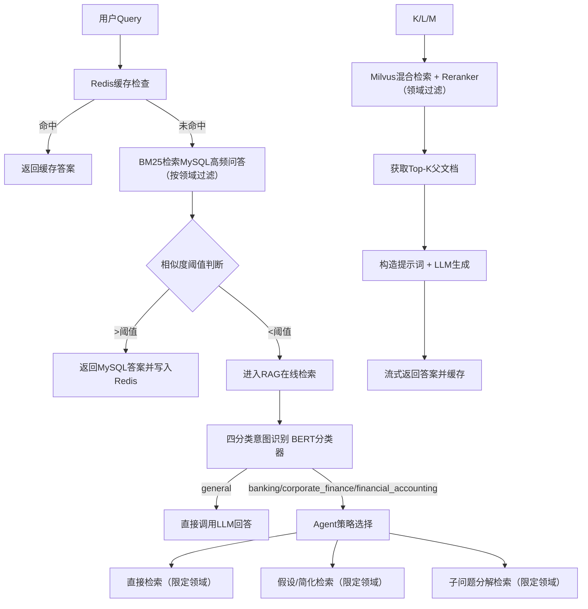

# 企业级金融RAG问答系统 - 完整项目流程文档（修订版）

> ⚠️ **本文档已过时（2026-09-12 标注）**：文中「四分类意图识别」与「BM25 单阈值早退」的描述已与代码不符——
> 当前实现为 **11 类金融子领域意图分类**，且 BM25 早退已改为**双门控**（softmax 相对分 ≥ 0.95 且 cross-encoder 绝对相关分 ≥ 0.90）；
> 另外系统已融合 ChatBI（问数）与 DocAudit（合规审查）两条链路。**请以 `FinRag_RAG全流程说明_技术版.md` 为准**。
> 本文档保留用于对比早期设计。

> **修订说明**：本版基于原文档，针对意图识别模块进行了升级——从二分类（通用/专业）扩展为**四分类**，覆盖 `banking_data`、`Corporate_Finance_data`、`Financial_Accounting_data` 三个金融领域及通用问题类别，并将对应的数据集作为内置知识库集成。其余流程和设计保持与原有架构兼容。

---

## 目录
1. [项目背景与目标](#1-项目背景与目标)
2. [系统整体架构](#2-系统整体架构)
3. [技术栈选型](#3-技术栈选型)
4. [模块详细设计](#4-模块详细设计)
   - 4.1 用户认证模块
   - 4.2 知识库管理模块
   - 4.3 高频问答对管理模块（含内置数据集）
   - 4.4 在线检索与问答流程（含四分类意图识别）
5. [数据存储设计](#5-数据存储设计)
6. [前端页面交互设计](#6-前端页面交互设计)
7. [核心算法与关键实现要点](#7-核心算法与关键实现要点)
8. [配置文件设计](#8-配置文件设计)
9. [测试计划与用例](#9-测试计划与用例)
10. [部署与运维](#10-部署与运维)
11. [开发计划](#11-开发计划)
12. [后续扩展方向](#12-后续扩展方向)

---

## 1. 项目背景与目标

本项目旨在构建一个面向金融领域的智能问答系统，支持用户通过自然语言提问，系统结合**高频问答对（MySQL）**、**离线知识库（向量检索+BM25）**和**大模型生成**，提供准确、可溯源的回答。系统具备以下核心能力：

- **高频问答缓存**：基于BM25检索MySQL中的高频问题，快速返回答案。
- **多领域知识库**：内置 `banking`、`corporate_finance`、`financial_accounting` 三个金融领域的问答对与文档知识库，同时支持用户自定义知识库。
- **四分类意图识别**：使用微调BERT模型识别用户问题所属领域（三类金融领域或通用问题），据此分流检索路径。
- **混合检索策略**：结合稠密向量检索（BGE-M3）与稀疏检索（BM25），并利用Reranker提升召回精度。
- **Agent动态决策**：根据意图分类结果自动选择最优检索路径（直接检索、假设改写、子问题分解等）。
- **全链路流式输出**：LLM回答流式返回，提升用户体验。

---

## 2. 系统整体架构



---

## 3. 技术栈选型

| 组件         | 技术选型                                 | 说明                                   |
| ------------ | ---------------------------------------- | -------------------------------------- |
| 后端框架     | FastAPI (Python 3.13+)                   | 异步高性能，自动生成API文档            |
| 前端框架     | Vue 3 + Element Plus                     | 年轻化交互界面，支持动态效果           |
| 数据库       | MySQL 8.0                                | 存储用户信息、高频问答对（含领域标签） |
| 向量数据库   | Milvus 2.3+                              | 存储文档向量，支持混合检索和领域过滤   |
| 缓存         | Redis 7.0                                | 缓存高频问答结果及BM25分词数据         |
| 大模型       | 通义千问 (qwen-max)                      | 通过DashScope API调用，支持流式输出    |
| 文本嵌入模型 | BGE-M3                                   | 稠密向量生成，支持多语言               |
| Reranker     | BGE-Reranker-V2-M3                       | 精排，提升检索精度                     |
| BM25实现     | rank_bm25 或 Elasticsearch               | 本地BM25算法，用于高频匹配             |
| 意图识别     | 预训练BERT分类器（四分类，金融领域微调） | 判别Query属于哪个领域或通用问题        |
| 文档解析     | PyPDF2, python-pptx, markdown, PIL       | 支持多种格式文档加载                   |
| 文本分块     | 递归字符分割 + 父子块关联                | 父块作为上下文，子块用于检索           |
| 包管理       | uv                                       | 快速依赖管理                           |
| 测试框架     | pytest                                   | 单元测试与集成测试                     |

---

## 4. 模块详细设计

### 4.1 用户认证模块（登录/注册）
- **登录**：用户名 + 密码 + 图形验证码（基于PIL生成），JWT Token返回。
- **注册**：用户名 + 密码 + 确认密码 + 图形验证码，密码一致性校验。
- 密码使用bcrypt哈希存储。
- 数据表：`users`（id, username, password_hash, created_at）。

### 4.2 知识库管理模块

#### 4.2.1 知识库创建与配置
- 用户可创建多个知识库，每个知识库具有唯一名称、描述。
- 知识库配置参数：文本分块大小（chunk_size）、重叠大小（overlap）、检索类型（稠密/混合）。
- 数据表：`knowledge_bases`（id, name, description, chunk_size, overlap, retrieval_type, owner_id, created_at）。
- **内置知识库**：系统启动时自动创建三个内置知识库（banking, corporate_finance, financial_accounting），仅管理员可管理，但所有用户均可检索（可配置）。

#### 4.2.2 文档上传与解析（离线知识库搭建）

**流程**：
1. 用户上传文档（PDF/PPT/Markdown/图片）至指定知识库。
2. 系统根据文件扩展名选择对应的解析器（Loader），提取文本内容及元数据。
3. 使用**父子分块**策略：
   - 父块：较大片段（如段落），存储于Milvus的父文档字段。
   - 子块：较小片段（如句子），用于向量检索，同时保存父块ID关联。
4. 将子块文本通过BGE-M3模型生成稠密向量，同时保留原始文本用于BM25索引（可构建Milvus稀疏向量）。
5. 若上传至内置知识库，自动添加 `domain` 标签（与知识库名称一致）；若上传至自定义知识库，用户可手动指定领域标签或沿用默认。
6. 将向量及元数据插入Milvus Collection。
7. 记录文档状态到MySQL：`documents`（id, kb_id, filename, file_path, status, chunk_count, created_at）。

### 4.3 高频问答对管理模块（含内置数据集）

- 数据表：`qa_pairs`（id, question, answer, type, domain, created_at）。
- **内置数据集**：系统初始化时，从CSV/JSON文件加载三个领域的问答对（分别标记 domain='banking'、'corporate_finance'、'financial_accounting'），同时也可包含部分通用问题。
- 支持用户自定义问答对（但本项目暂不开放前端管理，仅用于后台导入）。
- 启动时初始化BM25模型：
  1. 从MySQL加载所有问题（按领域分组或统一加载）。
  2. 对问题分词（使用jieba + 金融词典）。
  3. 将原始问题与分词列表写入Redis（key: `bm25_questions`，value: JSON，可保留领域信息）。
  4. 基于分词构建BM25模型（内存中，可按领域构建多个实例，也可统一构建并在检索时过滤）。

### 4.4 在线检索与问答流程

#### 4.4.1 入口与缓存检查
- 接收用户Query，首先检查Redis缓存（key: `qa_cache:{md5(query)}`），若命中则直接返回。
- 否则进入BM25高频匹配（注意领域过滤）。

#### 4.4.2 BM25高频匹配（按领域过滤）
- 对Query进行分词。
- 若已有意图识别结果（或前端指定领域），则限定 `qa_pairs` 中对应领域记录进行BM25计算；否则在所有记录上计算。
- Softmax归一化得到概率分布。
- 获取最高得分，若**高于阈值**（可配置，如0.7），则从MySQL取对应答案，写入Redis缓存，返回答案。
- 若低于阈值，进入RAG在线检索。

#### 4.4.3 四分类意图识别（BERT分类器）
- **模型**：基于金融领域语料（含三个领域和通用数据）微调的BERT模型，输出4类概率。
- **输入**：用户原始Query（可结合上下文信息）。
- **输出**：最高概率类别 `{'banking', 'corporate_finance', 'financial_accounting', 'general'}` 及其置信度。
- **使用**：该结果将决定后续检索的领域范围（若前端已指定知识库，则取交集；若无指定，则完全按意图结果）。
- **置信度阈值**：若最高置信度低于0.6（可调），则降级为在所有知识库中检索（即不做领域过滤），或交由LLM判断。

#### 4.4.4 Agent检索策略（动态路由，结合领域分类）

根据意图识别结果，Agent执行以下路径之一（也可配置为总是执行混合检索）：

| 分类结果                 | 检索路径                                                     |
| ------------------------ | ------------------------------------------------------------ |
| **general**              | 直接构造Prompt调用LLM（不检索任何数据库），回答后返回。若LLM认为需要知识，可配置为回退到全部检索。 |
| **banking**              | ① 检查Redis缓存（已做）。<br>② 在MySQL `qa_pairs` 中仅检索 `domain='banking'` 的记录，进行BM25匹配，阈值>0.7则直接返回答案。<br>③ 否则进入Milvus，在 `metadata.domain='banking'` 的集合（或内置knowledge_base的文档）中执行混合检索 + Reranker，取Top-K父文档。<br>④ 构造Prompt并调用LLM生成回答。 |
| **corporate_finance**    | 同上，领域限定为 `corporate_finance`。                       |
| **financial_accounting** | 同上，领域限定为 `financial_accounting`。                    |

**策略细化**（Agent可进一步选择以下方式）：
1. **直接检索**：将Query原样送入Milvus（带领域过滤）。
2. **假设/简化检索**：使用提示词让LLM对Query进行改写（如添加假设条件或简化术语），然后对改写后的Query进行检索。
3. **子问题分解检索**：让LLM将Query拆解为多个子问题，分别检索每个子问题，合并所有结果后去重排序。

**提示词设计**（中文）：
- 假设改写：_“将以下金融问题改写为更具体、可检索的假设性问题，并保持专业术语。”_
- 子问题分解：_“将以下复杂金融问题分解为3-5个独立的子问题，每个子问题聚焦一个方面。”_

#### 4.4.5 混合检索与重排序（带领域过滤）
- **稠密检索**：使用BGE-M3将Query转为向量，在Milvus中做ANN检索，同时指定过滤条件（如 `metadata.domain in [领域]`），返回Top-200候选。
- **稀疏检索**：使用BM25（或Milvus内置稀疏向量）检索，同样带领域过滤，返回Top-200。
- **融合**：采用RRF（Reciprocal Rank Fusion）或加权组合。
- **Reranker**：BGE-Reranker-V2-M3对融合后的候选进行精排，返回Top-K（K=5~10）父文档。

#### 4.4.6 提示词构造与LLM生成
- 将检索到的父文档拼接成上下文（限制Token长度）。
- 使用精心设计的Prompt模板（包含上下文、用户问题、指令，可注入领域提示）。
- 调用DashScope API（qwen-max），开启`stream=True`，流式返回答案。
- 将最终答案缓存至Redis（TTL可配置，如1天）。

---

## 5. 数据存储设计

### MySQL表结构（新增 domain 字段）

```sql
-- 用户表
CREATE TABLE users (
    id INT AUTO_INCREMENT PRIMARY KEY,
    username VARCHAR(50) UNIQUE NOT NULL,
    password_hash VARCHAR(255) NOT NULL,
    created_at TIMESTAMP DEFAULT CURRENT_TIMESTAMP
);

-- 知识库表（包含内置知识库标志）
CREATE TABLE knowledge_bases (
    id INT AUTO_INCREMENT PRIMARY KEY,
    name VARCHAR(100) NOT NULL,
    description TEXT,
    chunk_size INT DEFAULT 512,
    overlap INT DEFAULT 50,
    retrieval_type ENUM('dense', 'hybrid') DEFAULT 'hybrid',
    owner_id INT,  -- NULL表示内置知识库
    is_builtin BOOLEAN DEFAULT FALSE,
    domain VARCHAR(50) DEFAULT NULL, -- 用于内置知识库标记领域
    created_at TIMESTAMP DEFAULT CURRENT_TIMESTAMP,
    FOREIGN KEY (owner_id) REFERENCES users(id)
);

-- 文档表
CREATE TABLE documents (
    id INT AUTO_INCREMENT PRIMARY KEY,
    kb_id INT NOT NULL,
    filename VARCHAR(255) NOT NULL,
    file_path VARCHAR(500) NOT NULL,
    status ENUM('uploaded', 'parsing', 'indexed', 'failed') DEFAULT 'uploaded',
    chunk_count INT DEFAULT 0,
    created_at TIMESTAMP DEFAULT CURRENT_TIMESTAMP,
    FOREIGN KEY (kb_id) REFERENCES knowledge_bases(id)
);

-- 高频问答对（增加 domain 字段）
CREATE TABLE qa_pairs (
    id INT AUTO_INCREMENT PRIMARY KEY,
    question TEXT NOT NULL,
    answer TEXT NOT NULL,
    type VARCHAR(50), -- '事实性', '推理型', '情景型'
    domain VARCHAR(50) DEFAULT 'general', -- banking, corporate_finance, financial_accounting, general
    created_at TIMESTAMP DEFAULT CURRENT_TIMESTAMP
);
```

### Redis数据结构
- **缓存**：`qa_cache:{md5(query)}` → JSON `{answer, source, timestamp}`
- **BM25数据**：`bm25_questions` → JSON `{questions: [...], tokens: [[...]], domains: [...]}` 保留领域信息
- **会话管理**：`session:{user_id}:{session_id}` → 对话历史

### Milvus Collection设计（增加 domain 字段）

```python
collection_schema = {
    "fields": [
        {"name": "id", "type": DataType.INT64, "is_primary": True},
        {"name": "vector", "type": DataType.FLOAT_VECTOR, "dim": 1024},
        {"name": "sparse_vector", "type": DataType.SPARSE_FLOAT_VECTOR},
        {"name": "text", "type": DataType.VARCHAR, "max_length": 65535},
        {"name": "parent_text", "type": DataType.VARCHAR, "max_length": 65535},
        {"name": "metadata", "type": DataType.JSON},  # 包含 domain, kb_id 等
        {"name": "domain", "type": DataType.VARCHAR, "max_length": 50},  # 新增字段，便于过滤
        {"name": "kb_id", "type": DataType.INT64},
    ]
}
```

---

## 6. 前端页面交互设计

### 6.1 登录/注册页
- 图形验证码（动态刷新），表单校验。
- 登录成功后跳转至对话页。

### 6.2 对话页面
- **侧边栏**：显示当前用户的知识库列表（含内置知识库），用户可勾选一个或多个（可选全选）。
- **主区域**：消息列表（用户问题 + 回答），支持流式打字效果。
- **顶部工具栏**：
  - 新建会话（输入会话名称）。
  - 会话列表（可删除）。
  - 模型选择（默认qwen-max）。
  - 推理参数：温度（0~1）、topP（0~1）、max_tokens（100~2000）、历史对话轮数（1~10）。
  - **领域筛选开关**（可选）：可手动指定当前问题的领域，辅助意图识别（若用户指定则优先）。
- **输入框**：支持多行文本，发送按钮。

### 6.3 知识库解析页面
- 显示当前知识库下的文档列表，每个文档有解析状态。
- 上传按钮，支持拖拽上传。
- 上传后弹出配置对话框：分块大小、重叠大小、检索类型、领域标签（可选）。

### 6.4 知识库预览页面
- 展示某个知识库的所有文档块（分页）。
- 每个块显示文本内容、元数据（含领域），支持编辑和删除（删除后同步删除Milvus向量）。

### 6.5 知识库管理页面
- 导航栏“知识库”进入。
- 列表展示所有知识库（含内置），每个卡片有名称、描述、文档数、创建时间。
- 点击“上传文档”跳转至解析页面。
- 点击“预览”进入预览页面。

---

## 7. 核心算法与关键实现要点

### 7.1 BM25初始化与更新
- 每次服务启动时执行，或当qa_pairs表变更时触发。
- 分词使用`jieba`，并加载金融领域自定义词典（包含三个领域的术语）。
- Redis存储分词结果，按领域分组或统一存储，便于检索时过滤。

### 7.2 父-子分块实现
- 同原设计。

### 7.3 混合检索与重排序（带领域过滤）
- Milvus执行混合检索时，通过 `expr` 参数增加 `domain in [...]` 条件。
- Reranker输入候选列表时，需保证候选不超过最大长度。

### 7.4 四分类意图识别模型
- 训练数据：收集银行、公司金融、财务会计三个领域的QA对以及通用问题（如天气、百科），每类至少5000条，进行微调。
- 推理时，若置信度<阈值，则不做领域限制，采用全量检索。
- 可缓存分类结果（同一用户短时间多次问同领域可复用）。

### 7.5 Agent策略决策
- 初版可采用简单规则（如问题长度、关键词匹配）在意图分类基础上选择策略。
- 后续可升级为LLM驱动，通过Prompt让模型选择最佳策略并生成改写。

---

## 8. 配置文件设计

`config.yaml` 扩展新增意图识别配置：

```yaml
mysql:
  host: localhost
  port: 3306
  user: root
  password: root
  database: fin_rag

redis:
  host: localhost
  port: 6379
  password: 1234
  db: 0

milvus:
  host: localhost
  port: 19530
  database: fin_rag
  collection: finrag

llm:
  model: qwen-max
  api_key: os.getenv("API_KEY")
  base_url: https://dashscope.aliyuncs.com/compatible-mode/v1
  temperature: 0.7
  top_p: 0.9
  max_tokens: 1024

embedding:
  model_path: r"D:\FinRag\bge-m3"
  device: cpu

reranker:
  model_path: r"D:\FinRag\bge-reranker-v2-m3"

intent:
  model_path: /path/to/bert_finetuned_four_class
  labels: ["banking", "corporate_finance", "financial_accounting", "general"]
  confidence_threshold: 0.6

bm25:
  threshold: 0.7
  top_k: 10

retrieval:
  hybrid_weights: [0.5, 0.5]
  top_k: 5

cache:
  ttl_seconds: 86400

builtin_data:
  qa_files:
    banking: "data/banking_qa.csv"
    corporate_finance: "data/corporate_finance_qa.csv"
    financial_accounting: "data/financial_accounting_qa.csv"
  doc_dirs:
    banking: "data/banking_docs"
    corporate_finance: "data/corporate_finance_docs"
    financial_accounting: "data/financial_accounting_docs"
```

---

## 9. 测试计划与用例

### 9.1 单元测试
- **认证模块**：注册、登录、验证码。
- **BM25模块**：领域过滤的相似度计算。
- **四分类意图识别**：输入样本，验证输出标签。
- **分块模块**：父子块关联正确性。
- **Milvus操作**：带领域过滤的插入和检索。
- **Reranker**：排序正确性。
- **LLM调用**：流式输出mock。

### 9.2 集成测试
- **端到端流程**：上传文档 → 解析 → 索引 → 问答（含领域分流）。
- **高频问答命中**：验证缓存写入和命中，以及领域过滤生效。
- **多轮对话**：历史轮数限制生效。
- **知识库权限隔离**：不同用户只能访问自己的自定义知识库，但可访问内置知识库。
- **意图识别置信度兜底**：低置信度时降级为全量检索。

### 9.3 性能测试
- 检索延迟（<2s）。
- 并发用户数（≥50）。

---

## 10. 部署与运维

- 使用Docker Compose编排MySQL、Redis、Milvus、后端服务。
- 前端使用Nginx托管静态文件。
- 日志记录：同时输出到控制台和文件（`logs/`目录），便于故障排查。
- 健康检查端点：`/health`。
- 内置数据预加载：启动时检查并导入CSV文档，若未导入则自动执行。

---

## 11. 开发计划（建议）

| 阶段  | 任务                                         | 预计工期 |
| ----- | -------------------------------------------- | -------- |
| 第1周 | 环境搭建、数据库设计、用户认证模块           | 3天      |
| 第2周 | 文档解析与分块、Milvus索引模块（含领域标签） | 5天      |
| 第3周 | BM25高频问答模块（含内置数据集导入）         | 4天      |
| 第4周 | 四分类意图识别模型微调与集成                 | 5天      |
| 第5周 | RAG检索流程（领域过滤的混合检索+重排序）     | 5天      |
| 第6周 | Agent策略、LLM集成与流式输出                 | 5天      |
| 第7周 | 前端所有页面开发（含领域切换UI）             | 7天      |
| 第8周 | 前后端联调、测试用例编写与修复               | 5天      |
| 第9周 | 性能优化、部署、文档整理                     | 3天      |

---

## 12. 后续扩展方向

- 支持更多金融细分领域。
- 引入知识图谱增强推理能力。
- 支持用户反馈机制，优化检索排序。
- 接入更复杂的Agent框架（如LangGraph）实现自主决策。
- 增加多模态支持（如图表分析）。

