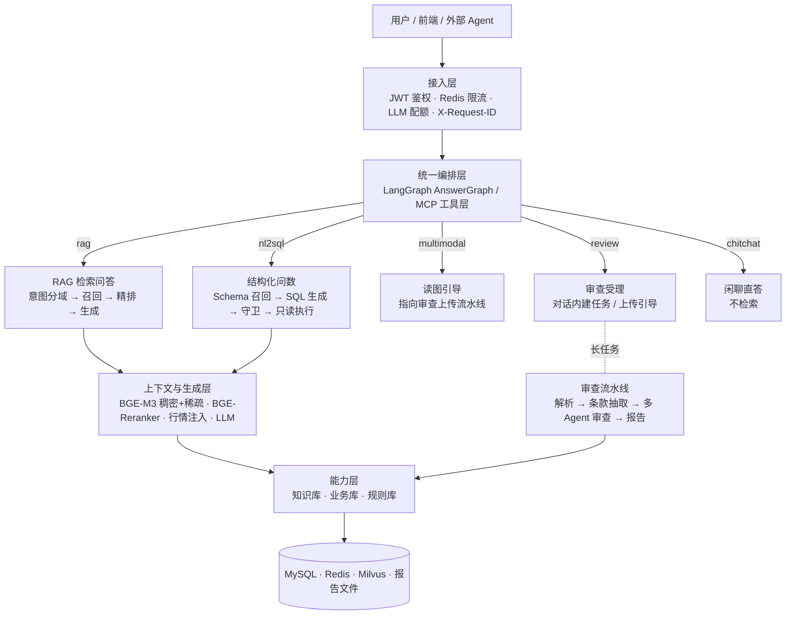
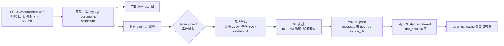
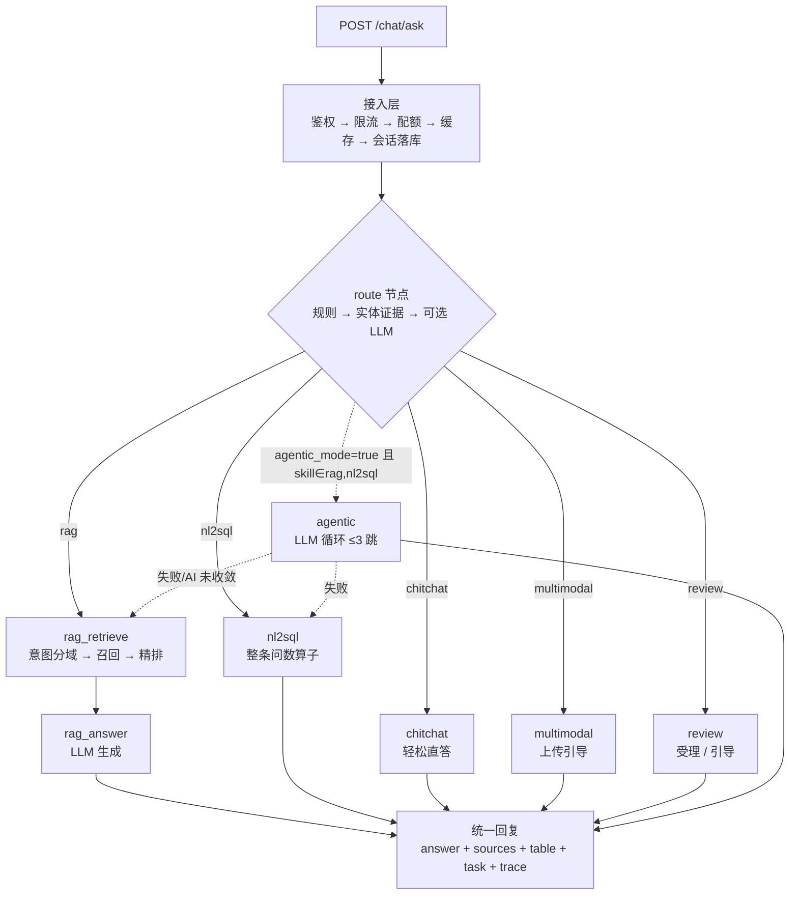
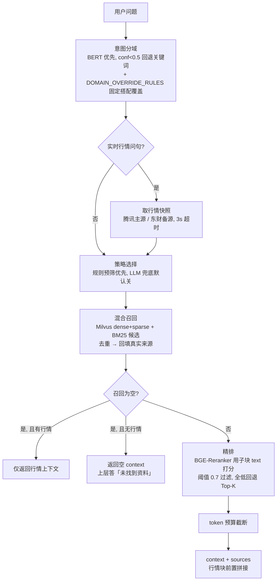
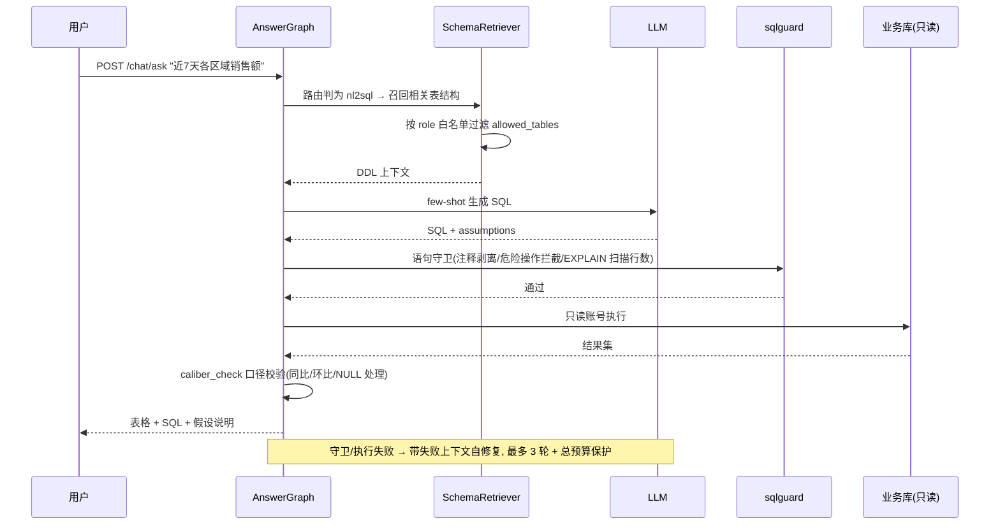

# FinRag 金融智能问答与合规审查平台 —— 完整流程说明（技术版）

> **文档范围**：本项目三条主线的全链路——① 离线建库（文档入库管线）② 在线问答统一编排
> （RAG 检索 / 结构化问数 / 读图引导 / 审查受理 / 闲聊 / 可选 Agentic 循环 / 实时行情注入）
> ③ 合规审查长任务，外加 ④ MCP 工具层对外出口。
>
> **读法**：第 1 节建立全局认知，第 2~5 节按链路逐段展开，第 6~8 节是数据、评估与降级，
> 第 9 节是中英对照总表。每节末尾的「**为什么这么设计**」是本文档价值最高的部分——
> 这里记录的都是踩过坑之后才确定的结论，不是教科书上的通用说法。
>
> 文中英文标识符第一次出现时在括号内标注中文，文末附总表。
> 仅覆盖 RAG 主链路的版本见根目录 `FinRag_RAG全流程说明_技术版.md`。

---

## 0. 一句话总览

一个用户请求进来，先过**接入层**（鉴权 / 限流 / 配额 / 会话 / 缓存），再进 **LangGraph
统一编排图（AnswerGraph）**：路由节点判定走哪条 Skill，然后分发到 RAG 检索问答、
结构化问数、读图引导、合同审查受理或闲聊直答。检索链路内部还串了六个环节：
**意图分域 → 多策略改写 → 混合召回 → 精排 → 行情注入 → LLM 生成**。

合规审查是**独立长任务**，不在编排图里——它要跑 OCR / 视觉模型 / 多轮 LLM 审查，
耗时以分钟计，塞进同步问答链路会拖垮所有并发请求。

### 四个入口，四种触发方式

| 主线 | 入口 | 触发方式 | 进度查询 |
|---|---|---|---|
| 离线建库 | `POST /api/v1/document/upload` | 立即返回 doc_id，后台线程处理 | `GET /document/processing` |
| 在线问答 | `POST /api/v1/chat/ask` （流式 `/chat/ask_stream`） | 同步返回 | SSE 逐节点进度 |
| 合规审查 | `POST /api/v1/review/upload` | 长任务，立即返回 task_id | `GET /review/task/{id}/events` |
| 工具化调用 | MCP stdio server（6 个 `finrag.*` 工具） | 外部 Agent 调用 | 同左，HTTP 转发 |

---

## 1. 系统分层与运行形态

### 1.1 分层架构



### 1.2 启动与就绪（`main.py::lifespan`）

服务启动时按顺序做六件事，全部**失败不阻塞启动**（只告警，首次请求时重试）：

1. 打印配置摘要（LLM 模型、BGE-M3 / Reranker 路径、MySQL / Redis / Milvus 地址）。
2. 后台守护线程加载 **BM25 索引**（从 MySQL `finance_faq` 全量读问答对，jieba 分词建索引）。
3. 后台并行**预加载三个模型**：BGE-M3（向量）、BGE-Reranker（重排）、BERT（意图分类）。
4. 幂等建表 / 迁移：审计表（`ensure_audit_table`）、审查表（`review_db.ensure_tables`）、
   知识库属主列（`ensure_kb_owner_columns`）。
5. 启动 **MySQL↔Milvus 对账定时任务**（间隔 0 表示关闭）。
6. 清理**孤儿文档**：把重启前卡在 parsing 状态的文档标记为 failed，让用户知道要重传。

**为什么这么设计**：

- **模型预加载 + 懒加载双保险**：BGE-M3 冷加载约 1 分钟。若不做预加载，第一个请求要等
  一分钟；若只做预加载，加载失败后服务就永久不可用——所以保留懒加载作为首次请求时的重试。
- **`/health` 与 `/health/ready` 分开**：浅健康检查不探外部依赖，供存活探针用；
  深就绪检查探 MySQL / Redis / Milvus + 模型状态，**关键项（DB + BGE-M3 + Reranker）
  必须全 ok 才算就绪，BERT 可降级不阻断**——因为 BERT 缺失时会自动回退关键词分类，
  服务仍可用，不该被 k8s 摘掉流量。

### 1.3 配置开关与回退关系

| 开关 | 默认 | 作用 | 关闭后行为 |
|---|---|---|---|
| `orchestrator.enable_answer_graph` | true | `/chat/ask` 是否走编排图 | 回退老链路 `_legacy_answer`（含 BM25 早退） |
| `orchestrator.agentic_mode` | false | rag/nl2sql 是否走 Agent 循环 | 走固定路由节点，行为零变化 |
| `orchestrator.review_enabled` | true | 是否受理合同审查 | review 规则命中降级为 rag |
| `orchestrator.route_llm_fallback` | false | 路由是否用 LLM 精判 | 仅规则 + 实体证据 |
| `retrieval.multi_strategy_enabled` | true | 是否启用多策略检索 | 恒为直接检索 |
| `market_data.enabled` | true | 是否注入实时行情 | 纯知识库检索 |
| `MILVUS_AUTO_RECREATE` | 未设 | schema 不匹配时是否重建集合 | 抛 RuntimeError（绝不静默 drop） |

---

## 2. 离线建库：文档入库管线



### 关键设计

- **立即返回 + 后台处理**：上传接口只做落盘与建记录，解析在 daemon 线程里跑。
  前端轮询 `/document/processing` 拿 `phase`（queued / parsing / embedding）与 `done/total`。
- **串行信号量（Semaphore(1)）排队**：文档处理是 CPU 密集任务（向量编码），并发跑多个
  上传会把笔记本 CPU 打满。排队 + `services/embedding.py` 内限 torch 线程数=核数一半，
  两道保护叠加。
- **可取消**：`threading.Event` 控制，**在批次之间生效**——不做逐块中断是为了避免
  Milvus 里留下写到一半的半成品。
- **全局唯一 chunk id**：`doc_{doc_id}_parent_{j}_child_{k}`。早期版本用「文件内序号」
  生成 id，同一知识库上传第二个文件时 id 与第一个文件完全重合，导致检索去重丢块、
  甚至串出别的文档内容。旧文档用 `scripts/reindex_kb_docs.py` 重建。
- **删除必须复核**：按 `metadata["doc_id"]` 精确删，无命中再回退按 `source_file` 删；
  删后用 `_delete_expr_until_empty`（8 轮 × 1.5s）反复确认——Milvus 插入/删除有秒级
  可见性延迟，删一次就返回会留下「查得到但已删」的幽灵数据。

**为什么父块/子块分离**：子块（300 字）用于匹配，语义聚焦、向量信噪比高；
父块（1200 字）用于喂给 LLM，上下文完整。检索时用子块打分，命中后取父块原文。

---

## 3. 在线问答：AnswerGraph 统一编排

### 3.1 编排图结构



条件边（`graph._branch`）只有一条特殊规则：**当 `agentic_mode=true` 且 skill 是
rag 或 nl2sql 时，改走 `agentic` 节点**；其余 skill 永远走固定节点——闲聊、读图、
审查不需要工具循环，套上循环只是白烧 token。

### 3.2 接入层（`ask_unified`）

依次做五件事，顺序有讲究：

1. **输入净化**（`sanitize_input`），空问题 400。
2. **LLM 配额检查**（`_check_llm_quota`）——放在检索之前，超配额用户不必白耗
   Milvus / BM25 / Reranker 算力就能拿到 429。
3. **缓存查询**。缓存 key 为 `ask:{skill_hint}:{role}:{question}`：
   - 带 `skill_hint` 是为了**避免问数的旧答案污染 RAG 缓存域**；
   - 带 `role` 是因为知识库按角色鉴权，不加这一维会让 admin 可见内容泄露给普通用户。
4. **会话落库**（用户消息），缺失会导致多轮指代消解拿不到上下文。
5. 执行编排图，回包后按同一套规则写助手消息与缓存。

> **为什么缓存只在 rag / chitchat 域**：问数结果依赖实时业务数据、审查结果带一次性
> task_id，都不该被 24h 缓存冻结。而且二次校验用的是**实际生效的 skill**而不是
> `skill_hint`——运行时路由可能用实体证据把预路由的 rag 精修成 nl2sql，只信预路由
> 会把问数结果写进 rag 缓存域。

**限流**（`main.py` 中间件）按 scope 分档，Redis 固定窗口、**不可用时 fail-open 不阻塞业务**：
认证接口防爆破（验证码为主防线，限流兜底）、问答接口防单 IP 刷量、问数 / 审查上传 /
审查查询各有独立额度（问数打业务库、审查跑 OCR 流水线，都不能和普通问答共用配额）。

### 3.3 路由层：规则 → 实体证据 → LLM 兜底

三阶段逐级收紧，**前两阶段完全可离线复现**（评测脚本只依赖规则阶段）。

**阶段一：纯规则（确定性，零开销）**，优先级从高到低：

| 顺序 | Skill | 判据 | 为什么在这个位置 |
|---|---|---|---|
| 1 | review | 强审查词，或「文档指示词 + 动作词」组合 | 审查请求常带「扫描件」信号，若先判 multimodal 就只给上传引导、丢掉审查意图 |
| 2 | multimodal | 图片/扫描/OCR 等强信号词 | 读图类问题走纯文本检索只会答非所问 |
| 3 | rag | 金融知识/政策/合规强信号词（存款保险、征信、条例…） | 这些是本系统知识库主体，不可能出现在业务库表里 |
| 4 | nl2sql | 业务口径强信号词（GMV、销售额、退货率、同比…） | 必须在 rag 之后：nl2sql 词表若含「最高/平均/增长」等泛词，会把「存款保险最高赔付多少」误判成问数 |
| 5 | chitchat | 寒暄词 | 仅在没有任何业务词时才判 |
| 6 | rag（兜底） | 以上全不命中 | 默认走知识问答，`explicit=False` 标记 |

**阶段二：业务实体证据精修**（`refine_with_entities`，需连库、仅运行时）。

从问数的 MetaStore（元数据库，含 table_registry / column_registry / metric_dict）
构建「业务实体词表」，对问题做**加权打分**（指标口径 3.0 > 表名 2.5 > 字段 1.5 >
枚举样本值 1.0），长词优先命中后屏蔽子串（避免「净销售额」和「销售额」重复计分）。
然后做两件词表做不到的事：

- 规则判 nl2sql 但**实体得分低于阈值 → 降级 rag**。这是「存款保险最高赔付多少」
  这类知识问题被泛词误判的最后一道防线。
- 规则走默认兜底 rag 但**实体强命中 + 带聚合意图 → 升级 nl2sql**。这能捞回
  「华东大区上个月单量多少」这类没踩中任何关键词的问数。

> **为什么要这一层**：纯关键词是黑名单博弈——业务表一变（新增表 / 新指标）就漏，
> 而「最高 / 平均 / 本月 / 区域」这些泛词在知识问句里同样高频。把「业务库里到底
> 有没有这个实体」作为判据，才能从根上消除误判。元数据不可用时完全退回阶段一，
> 服务不降级。

**阶段三：LLM 兜底**（默认关闭）。仅当规则落到默认 rag 且配置开启时才调用，
失败返回 None 回退规则结果。

### 3.4 RAG 检索链路（`_build_context`）

这是被复用最多的一段代码——老链路、`/chat/ask`、MCP 的 `kb_search` 工具全走它。



**逐环节说明**：

- **意图分域**：输出 11 类金融子领域标签（banking / fintech / stock_market …）。
  微调 BERT 优先，置信度 < 0.5 才回退关键词。跨词歧义会被表层词带偏——「存款保险」
  曾被判成 insurance 域，导致 banking 域的《存款保险条例》召回不到，所以加了
  `DOMAIN_OVERRIDE_RULES`（固定搭配覆盖，**优先级高于 BERT**）。
- **领域过滤零命中回退全库**：分域后若 Milvus 过滤无命中，自动去掉 domain 再检索一次
  （`_hybrid_recall` 内）。否则一次误判就直接落到「无检索结果」，只能让 LLM 凭空作答。
- **策略选择**（`strategy_selector.select_strategy`）：直接检索 / HyDE 假设答案 /
  子查询分解 / 回溯简化。规则预筛零开销；LLM 兜底默认关闭。**改写只影响「用什么文本
  去召回」，精排始终用用户原始问题打分**——相关性以用户意图为准，不被改写带偏。
- **混合召回**：Milvus 稠密 + 稀疏双向量检索，加 BM25 候选，按 `question` 去重后
  **统一回填真实来源**（Milvus 实体不存来源，按 question 回查 MySQL FAQ 的来源表）。
- **精排**：BGE-Reranker 打分，取 Top-5，阈值 0.7 过滤，全低于阈值时回退原始 Top-K
  （宁可给弱相关结果，也不返回空白）。**打分文本必须用子块 `text` 而非父块 `answer`**
  ——父块全文会让分数饱和到 ~0.99，无关的长文本反而霸榜。已封装为 `rerank_text()`。
- **token 预算截断**：按估算 token 数裁剪 context，防止超大上下文溢出 LLM 窗口。

**BM25 早退的边界（容易搞错）**：早退逻辑只存在于**老链路** `_legacy_answer`
（`/chat/` 与 `enable_answer_graph=false` 的回退路径）。它是**双门控**：softmax ≥ 0.95
**且** cross-encoder 绝对相关分 ≥ 0.90。

> 为什么必须双门控：`softmax_score` 是**在全部 FAQ 上做 softmax**，衡量的是「比其他
> FAQ 领先多少」（相对分数），不代表真的相关。实测「股票发行注册制改革」误命中
> 「债券注册制改革全面落地」softmax = 0.985，而 rerank 只有 0.047。**光调高阈值治不了
> 本**（0.985 已贴近 1.0）。校准数据：误命中 rerank ≈ 0.047，精确命中 ≈ 0.9988~1.0，
> 区间极宽，所以用绝对分做第二道闸。

统一入口 `/chat/ask` **没有早退**——BM25 命中只作为候选进 Reranker 一起竞争。
这样上传的文档块不会被一条静态 FAQ 挡在检索之外。

### 3.5 问数链路（NL2SQL）



- **元数据共享**：MetaStore 与路由层**共用同一实例**（`route.get_route_meta`），
  避免路由的实体词表与问数的 Schema 召回各加载一份元数据。
- **Schema 召回按角色白名单**：`allowed_tables_for(role)` 限制可见表，普通用户查不到
  敏感业务表。
- **总预算保护**：单轮生成有 30s 硬超时，整体有「单轮超时 × 2」的总预算；
  多轮修复累计超时就**拒答收尾**，绝不把延迟堆到 80s+。
- **口径校验**：`caliber_check.py` 做 5 类**确定性** post-check（同比 / 环比 /
  NULL 处理 / 明细聚合 / 时间窗），不依赖 LLM，防止模型写出「口径看着对但实际错」
  的 SQL。
- **拒答优先于乱答**：没有召回任何表结构时直接返回「换种问法」的引导，不硬生成。

### 3.6 读图引导与审查受理

- **`multimodal_node`**：融合前 multimodal 被静默并入 rag，用户问「这张图里写着什么」
  会被当文档问答去检索知识库，返回一堆无关条文。现在显式接管：说明能力边界、
  指向 `/review/upload`，**不编造答案**。
- **`review_node`**：两种形态——问题里带了待审正文（粘贴的合同条款）就**合成 PDF
  建任务**并后台跑流水线，回 task_id 供追问；只是问「能审吗 / 帮我审这份文件」
  就给出上传引导。

> 为什么粘贴的正文要合成 PDF 而不是直接喂给审查图：DocAudit 的条款抽取依赖
> **页码回验**（`coverage_threshold = 0.80`，抽出的条款原文必须在对应页面上找得到），
> 必须有真实分页。用 `fitz` 按页写入即可零改造复用整条「解析 → 抽取 → 审查 → 报告」链路。

### 3.7 Agentic 循环（可选，`agentic.py`）

与固定编排的区别：固定路由一次定型、问数与问答互斥；Agent 循环把**工具列表交给
LLM 循环决策**——规划 → 调工具 → 观察结果 → 不够就换问法再调 → 收尾作答。

| 可用工具 | 底层实现 |
|---|---|
| `kb_search` | 与 `rag_retrieve_node` **同一份** `_build_context` |
| `sql_query` | 与 `nl2sql_node` **同一份** Nl2SqlService |
| `finish` | 收尾，按已收集资料生成答案 |

由此获得三个固定编排做不到的能力：**多跳检索**（第一轮不相关时自主改写重查）、
**跨工具组合**（「存款保险最高赔多少，再查下今年赔付笔数」可串 RAG + 问数）、
**结果自评**（看命中数与分数决定继续还是收尾）。

**安全设计（金融场景确定性优先）**：

- `agentic_mode` **默认关闭**，关闭时走原固定路由、行为零变化；
- LLM 决策失败 / 超跳数（`agentic_max_hops = 3`）/ 工具连续异常 → **一律回退固定路由
  节点，绝不把「Agent 失败」当答案返回**；
- 工具就是进程内的检索与问数服务，无新增外部依赖与权限面。

> **踩过的坑**：回退函数必须是 `async def` 并 `await` 调用目标节点。`rag_retrieve_node`
> 等都是协程，同步函数里 `return 协程对象` 会让 LangGraph 报
> `Expected dict, got coroutine` → 500。真实联调时抓到的。

### 3.8 实时行情注入（P5）

**起因**：问「现在的股市行情如何」时，知识库全是静态制度资料，必然低相关 → 全部
低于 0.7 阈值 → 回退 Top-5 → LLM 只能答「资料未包含实时行情」。这是**能力错配**，
不是检索 bug。

**方案**：`services/market_data.py`（纯标准库），在共享的 `_build_context` 里注入
一个独立行情上下文块。

| 环节 | 实现 |
|---|---|
| 问句判定 | `is_realtime_query()` 识别 13 类行情问法 |
| 多源取数 | 主源腾讯 `qt.gtimg.cn`（GBK 文本，urllib 可用）；备源东财 push2（JSON） |
| 缓存 | 成功缓存 30s、失败短缓存 10s、超时 3s，失败仅 WARNING 不抛异常 |
| 注入 | 行情块**前置**拼接到检索 context，`sources[0]` 带 `type: realtime_market` |

**必做的三件配套**（缺一件等于没做）：

1. **缓存旁路**——行情类问句不读不写 `finrag:qa:` / `ask:` 缓存，否则 24h 缓存会把
   「某个时点的行情」冻住。
2. **BM25 早退让路**——老链路里静态 FAQ 会直接返回，把行情注入挡掉，必须放行。
3. **溯源不写死数据源**——曾出现「数据来自腾讯、标注写东财」，必须取自真实生效的
   那一次取数。

此外，知识库零命中但含行情时**只返回行情上下文**，不答「未找到资料」。

> **环境相关坑**：东财 push2 会拒绝部分 urllib 客户端（`RemoteDisconnected`，但 curl
> 正常），所以必须做多源 auto 兜底，不能依赖单源。

---

## 4. 合规审查长任务

```mermaid
flowchart TB
    A[POST /review/upload<br/>PDF/图片 ≤ 限额] --> B[create_task<br/>写 docaudit_review_task, 立即返回 task_id]
    B --> C[后台 asyncio 任务 spawn_pipeline]
    C --> D[阶段一 解析<br/>逐页路由 + Semaphore 2 并发]
    D --> D1{页面文本层字符数}
    D1 -->|足够| D2[digital: PyMuPDF 直接抽文本]
    D1 -->|不足| D3[render PNG → RapidOCR<br/>置信度低则视觉模型兜底]
    D2 --> E[阶段二 条款抽取]
    D3 --> E
    E --> E1[LLM 结构化抽取 clause<br/>shingle_coverage 回验 ≥0.80<br/>连续性检查, 缺陷记录]
    E1 --> F[阶段三 审查 LangGraph<br/>batch_size=4]
    F --> G[单条款: 规则检索 → 比对 Agent → 双温度仲裁 → 分级 Agent]
    G --> H[阶段四 报告 + HITL]
    H --> I{有 pending_review?}
    I -->|是| J[stage=hitl_pending<br/>人工 apply 后恢复]
    I -->|否| K[stage=completed<br/>生成 markdown 报告]
    C -.SSE 事件.-> L[task_events 轮询<br/>/review/task/{id}/events]
```

### 各阶段要点

- **阶段一 解析**（`_parse_document`）：逐页判定走数字文本还是 OCR。
  `page_concurrency = 2` 限并发，避免大量页面的视觉模型调用把 API 配额打爆。
  `parser_summary` 记录每页实际用了哪个解析器，写回文档表供溯源。
- **阶段二 条款抽取**：LLM 输出结构化条款后，用 `shingle_coverage`（12 字 shingle
  覆盖率）**回验**条款原文是否真在对应页面上出现，低于 `coverage_threshold = 0.80`
  判为缺陷；再做条款编号连续性检查（缺号即记录）。这两步是**防幻觉的硬约束**——
  没有回验，模型编造的条款会直接进入审查结论。
- **阶段三 审查图**（`review/graph.py`）：`prepare → review_batch → advance → report`，
  `advance` 用条件边循环直到处理完全部条款。单条款内部走四步：
  1. **规则检索**：按条款内容召回监管规则（`RuleRetriever`）。
  2. **比对 Agent**：判断 compliant / violation / insufficient_evidence，
     **Pydantic 校验输出结构**，且**违反的规则 ID 必须在本次检索到的规则集合内**，
     否则丢弃——防止模型引用不存在的规则。
  3. **双温度仲裁**：violation 属高代价结论，用温度 0.7 复核一次；
     两次判定冲突即标记转人工。
  4. **分级 Agent**：定 high / medium / low，风险等级失败时用
     `_fallback_risk` 按命中规则的严重度**确定性映射**兜底。
- **阶段四 报告与 HITL**：汇总摘要 + 生成 markdown 报告（含 LLM 综述），
  写 `docaudit_report`。只要存在待人工复核的条款，任务停在 `hitl_pending`，
  人工 `POST /review/reviews/{id}/apply` 后再恢复流水线。

**为什么审查必须独立成图 + 长任务**：一次审查要跑 OCR、多次 LLM 调用、双温度复核，
耗时分钟级且失败重试成本高。塞进同步问答链路会长时间占用 worker，把并发打穿；
独立端点 + 幂等 stage 记录 + 可恢复，才是能上生产的形态。

---

## 5. MCP 工具层（对外出口）

把内部能力封装成标准 MCP 工具，供外部 Agent 调用。**纯标准库实现**，零新增依赖。

| 工具名 | 作用 | 超时 |
|---|---|---|
| `finrag.ask` | 端到端问答（自动路由，不确定走哪条链路时用） | 120s |
| `finrag.kb_search` | 知识库检索（只检索不生成，返回带溯源片段） | 60s |
| `finrag.sql_query` | 经营数据问数（自然语言 → SQL → 表格） | 120s |
| `finrag.review_upload` | 合同审查上传，立即返回 task_id | 90s |
| `finrag.review_status` | 审查任务进度与结论摘要 | — |
| `finrag.review_report` | 拉取审查报告 | — |

### 关键设计

- **HTTP 薄壳**：MCP server **不加载模型、不连库**，所有调用都通过 urllib 转发给常驻的
  `:8000` 服务。原因：BGE-M3 冷加载 1 分钟，若 MCP server 自己持模型，外部 Agent
  第一次调用就会超时。
- **stdout 单独改道**：stdio 协议的 stdout 是**协议通道**，任何业务日志写到 stdout 都会
  污染协议。改道必须**先于 import 业务模块**执行，否则 import 期的日志已经打印出去。
- **registry 管控**：白名单 + 参数 schema 校验 + 超时 + 审计（
  `logs/mcp_audit.jsonl`，字段名与值**双重脱敏**）。
- **服务端配套**：新增 `POST /api/v1/chat/search`（只检索不生成），这是 Agentic RAG
  「检索 → 评估 → 再检索」循环的基础设施——Agent 先看检索结果，再决定是否换问法、
  是否要端到端回答。

---

## 6. 数据存储与数据流

| 存储 | 存什么 | 关键键/表 |
|---|---|---|
| MySQL 主库 | 用户、会话、知识库、文档元数据、FAQ、审计日志、配额 | `documents` / `knowledge_bases` / `finance_faq` |
| MySQL 业务库 | 结构化经营数据（问数目标） | 只读账号 `chatbi_ro`，独立连接池 |
| MySQL 审查库 | 审查任务、文档、条款、审查结论、报告索引 | `docaudit_review_task` / `docaudit_clause` / `docaudit_report` |
| Redis | 答案缓存、会话消息、用户会话 ZSET、分布式限流、上传队列状态 | `finrag:qa:` / `ask:{skill}:{role}:` / `finrag:user_sessions:{uid}` |
| Milvus | 文档块向量（稠密 + 稀疏双向量） | 集合内 `question`=chunk id、`text`=子块原文、`answer`=父块全文 |
| 文件系统 | 上传临时文件、页面 PNG、审查报告 markdown | `uploads/pages/{doc_id}` / `reports/report_{task_id}.md` |

**对账机制**：`services/reconciliation.py` 定时比对 MySQL 文档记录与 Milvus 向量，
发现孤儿数据即修复或告警（间隔 0 关闭）。

---

## 7. 评估与可观测性

| 维度 | 手段 |
|---|---|
| 检索质量 | RAGAS 四维指标（忠实度 / 答案相关性 / 上下文精确率 / 上下文召回率） |
| 实验对比 | `GET /api/v1/evaluation/experiments/compare`（files= 或 latest=N），多轮回归对照 |
| 路由质量 | `scripts/eval_routing.py` 只依赖规则阶段，**离线可复现**；输出命中关键词组 |
| 问数质量 | `scripts/eval_nl2sql.py` 逐题明细 + in-schema 口径正确率（正确拒答移出分母） |
| 运行指标 | Prometheus `/metrics`；**标签用路由模板而非原始路径**，否则动态 ID 会让指标基数无限膨胀 |
| 链路追踪 | 响应里带 `trace`（如 `route->rag → rag_retrieve → rag_answer`），Agent 模式带 `agent_hops` |
| 请求关联 | 全局 `X-Request-ID` 中间件 + 结构化异常处理器（422 / 500 都带 request_id） |

---

## 8. 降级与异常矩阵

| 故障点 | 行为 | 是否影响可用性 |
|---|---|---|
| Redis 不可用 | 限流 fail-open；缓存 miss 走全链路 | 否 |
| BM25 加载失败 | 首次请求时重试，失败则无 FAQ 候选 | 否 |
| BERT 分类器缺失 | 回退关键词分类 | 否（`/health/ready` 标 degraded 但仍 200） |
| BGE-M3 / Reranker 未就绪 | `/health/ready` 返回 503，导流摘除 | 是（核心依赖） |
| Milvus 连接失败 | 懒连接不缓存客户端，恢复后无需重启服务 | 否（恢复即用） |
| 领域过滤零命中 | 自动回退全库检索 | 否 |
| 精排全低于阈值 | 回退原始 Top-K | 否 |
| LLM 生成失败 | 取检索 context 首条 QA 答案兜底，`status=degraded` | 否 |
| 主模型失败 | 降级链 `llm.fallback_model` 重试备用模型一次 | 否 |
| 问数生成超时/守卫不过 | 带失败上下文自修复 ≤3 轮，总预算超时则拒答 | 否 |
| Agent 决策失败/跳数用尽 | 回退固定路由节点 | 否 |
| 行情取数失败 | 短缓存 10s，回退纯知识库检索 | 否 |
| 文档处理中断 | 重启后孤儿文档标记 failed；取消则回滚已写向量 | 否 |
| Milvus schema 不匹配 | 抛 RuntimeError（绝不静默 drop）；开发可用环境变量重建 | 是（需人工介入） |

---

## 9. 中英对照总表

### 配置项

| 英文 | 中文 |
|---|---|
| `enable_answer_graph` | 启用统一编排图 |
| `agentic_mode` | Agent 循环模式开关 |
| `agentic_max_hops` | Agent 最大跳数 |
| `route_entity_min_score` | 路由实体证据最低分阈值 |
| `route_llm_fallback` | 路由 LLM 兜底开关 |
| `multi_strategy_enabled` | 多策略检索开关 |
| `strategy_llm_fallback` | 策略选择 LLM 兜底开关 |
| `retrieval_k` | 召回条数 |
| `similarity_threshold` | 相似度过滤阈值 |
| `answer_top_k` | 精排保留条数 |
| `parent_chunk_size` / `child_chunk_size` / `chunk_overlap` | 父块 / 子块大小 / 重叠长度 |
| `repair_max_rounds` / `gen_timeout_seconds` | 问数自修复轮数 / 单轮生成超时 |
| `batch_size`（审查） | 审查批大小 |
| `coverage_threshold` | 条款回验覆盖率阈值 |
| `page_concurrency` | 解析页并发数 |
| `market_data.enabled` | 实时行情注入开关 |

### 业务字段与结构

| 英文 | 中文 |
|---|---|
| `skill` | 技能（链路类型：rag / nl2sql / chitchat / multimodal / review） |
| `domain` | 领域标签（= 知识库 category） |
| `sources` | 答案溯源列表 |
| `source_url` | 来源链接 |
| `trace` | 链路轨迹 |
| `degraded` | 是否降级 |
| `status` | 状态（ok / refused / degraded / error） |
| `confidence` | 置信度 |
| `softmax_score` | BM25 相对领先分 |
| `rerank_score` | 精排绝对相关分 |
| `realtime_market` | 实时行情（sources 条目类型） |
| `task_id` | 审查任务 ID |
| `hitl_pending` | 待人工复核 |
| `needs_human` | 是否需人工复核 |
| `verdict` | 条款判定（compliant / violation / insufficient_evidence） |
| `risk_level` | 风险等级（high / medium / low） |
| `assumptions` | 问数假设说明 |
| `repair_rounds` | 自修复轮次 |

### 接口

| 英文 | 中文 |
|---|---|
| `/chat/ask` / `/chat/ask_stream` | 统一编排问答（同步 / 流式） |
| `/chat/search` | 知识库检索（只检索不生成） |
| `/nl2sql/ask` / `/nl2sql/execute` | 问数 / 直接执行 SQL |
| `/review/upload` | 审查上传（建长任务） |
| `/review/task/{id}/events` | 审查任务事件轮询 |
| `/review/reviews/{id}/apply` | 人工复核应用 |
| `/document/upload` / `/document/processing` | 文档上传 / 处理进度 |
| `/health` / `/health/ready` | 浅健康 / 深就绪检查 |
| `/metrics` | Prometheus 指标 |

### 数据表

| 英文 | 中文 |
|---|---|
| `documents` | 文档表 |
| `knowledge_bases` | 知识库表 |
| `finance_faq` | 金融高频问答对表 |
| `docaudit_review_task` | 审查任务表 |
| `docaudit_document` | 审查文档表 |
| `docaudit_clause` | 条款表 |
| `docaudit_report` | 审查报告表 |

---

## 附：图 ↔ 节 对应关系

| 图 | 对应章节 | 用途 |
|---|---|---|
| 四入口对照表 | 0 | 一张表说清三条主线的触发方式 |
| 分层架构图 | 1.1 | 讲系统由哪几层组成、请求怎么往下走 |
| 入库管线图 | 2 | 讲文档从上传到可检索经过了什么 |
| AnswerGraph 编排图 | 3.1 | 讲一个请求怎么被分发到五条链路 |
| RAG 检索链路图 | 3.4 | 讲检索内部六个环节（**讲得最细的一张**） |
| 问数时序图 | 3.5 | 讲自然语言怎么变成 SQL 与表格 |
| 审查流水线图 | 4 | 讲长任务的四个阶段与 HITL 卡点 |
| 降级矩阵表 | 8 | 应对「出错了怎么办」的追问 |
